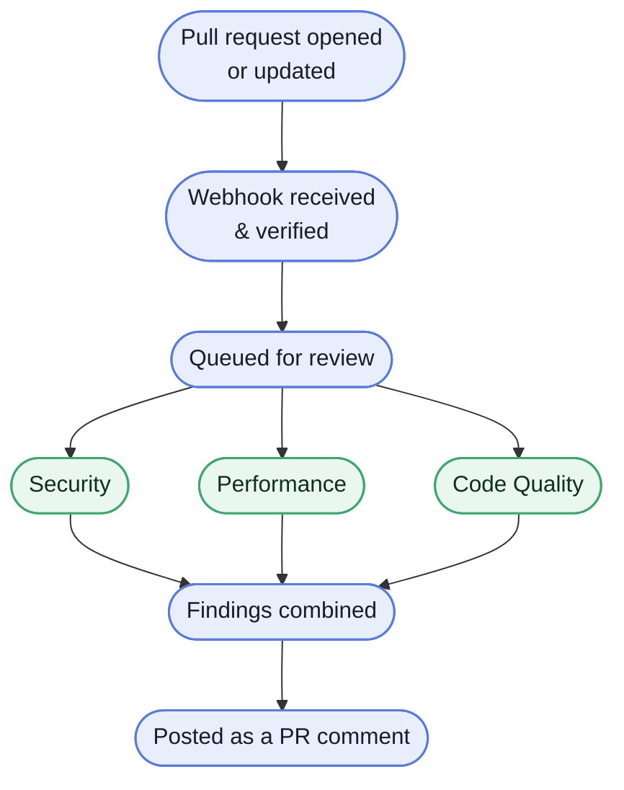

# Autonomous Code Review Engine

[](https://github.com/TovTechOrg/pr-review-bot/actions/workflows/ci.yml)


Open a pull request, and this bot reviews it automatically — checking for
security risks, performance issues, and code-quality problems — then posts
the results as a single comment on the PR itself. Three specialists run in
parallel, and later pushes edit that same comment in place rather than
piling up new ones.

**[Deploy your own →](https://tovtechorg.github.io/pr-review-bot/setup/)**
— the full setup guide, from a fresh clone to a first posted review comment.
The same pages live in [`guide/`](guide/setup/index.md) if you would rather
read them in the repo.

**[Try the setup wizard →](https://onboarding-wizard-mk6m.onrender.com/)**
— this repo's own live deployment; provision your own bot+dashboard Render
service from your browser, no local clone needed.

Full design: [`SPEC.md`](SPEC.md). Stack/conventions: [`CLAUDE.md`](CLAUDE.md).
Cost model: [`cost.md`](cost.md).

## Architecture



<details>
<summary><strong>Implementation detail</strong></summary>

- Webhook reads the **raw body**, verifies the HMAC-SHA256 signature in
  constant time, and returns `401` if it doesn't match.
- Each delivery is deduplicated on `X-GitHub-Delivery` — a replay gets a
  `200` no-op instead of a second review.
- A valid delivery becomes a durable Postgres ticket; the webhook returns
  `202` immediately — no LLM work happens in the request path.
- A single background dispatcher drains the queue FIFO, one ticket at a
  time, honoring a deferred ticket's `not_before`.
- A `429` from the provider posts/keeps a placeholder comment and reschedules
  the ticket — durable across a restart.
- Results (successes *and* failures) are merged with timing and cost data
  into one Markdown comment, edited in place on every later push.

See [`SPEC.md` §12](SPEC.md#12-review-queue-rpm--daily-quota-handling) for
the full queue design.
</details>

## Repo structure

This is a 2-member uv workspace:

- **Repo root** — the review engine described above (webhook, orchestrator,
  specialists, providers, review_queue). This repo's own deploy.
- **`dashboard/`** — the ops dashboard below, deployed in the same
  process as the root app (one Render service, one Dockerfile:
  `Dockerfile`), organized as its own package for a clear module
  boundary.

## What a review looks like

A real posted comment, condensed to one finding per specialist:

```markdown
## 🤖 Automated Code Review — PR #42
_3 specialists · llama-3.3-70b-versatile (groq) · 4.2s · ~$0.0021_

### 🔒 Security — 1 finding
| Severity | Line | Issue | Suggested fix |
| --- | --- | --- | --- |
| 🔴 critical | `app/auth.py:88` | API key is logged in plaintext when the request fails | Log only the key's length/hash, never the raw value |

### ⚡ Performance — 1 finding
| Impact | Line | Issue | Suggestion |
| --- | --- | --- | --- |
| 🟡 medium | `app/api/users.py:145` | N+1 | Batch these lookups into a single query |

### 🧹 Code Quality — 1 finding
| Category | Line | Issue | Refactoring suggestion |
| --- | --- | --- | --- |
| duplication | `app/utils/format.py:22` | Date-formatting logic is duplicated across three modules | Extract a shared helper |

---
<sub>Runtime 4.2s · 1,842 tok in / 612 tok out · est. $0.0021 · provider: groq</sub>
```

If a specialist's own check fails outright, its section says so plainly
instead of vanishing — partial failure is always visible, never silent.

## Tech stack

FastAPI (async) · `uv` · PyGitHub (GitHub App auth) · `google-genai` +
`groq` behind a swappable `LLMProvider` seam · Pydantic v2 validate-repair ·
`pytest`/`pytest-asyncio`/`respx` · Docker · Render + Supabase Postgres.

## Running locally

```bash
uv sync
cp .env.example .env   # fill in real values — see the guide's setup section
uv run uvicorn main:app --host 0.0.0.0 --port 8000
```

- `GET /healthz` → `200`
- `POST /webhook` → `401` (bad/missing signature), `200` (replayed delivery),
  or `202` (accepted, review runs in the background)
- `GET /` → the live ops/demo dashboard — light/dark/system theme,
  English/Hebrew with RTL, auto-refreshing review history and queue stats.
  Requires signing in at `/login` first with the configured `DASHBOARD_*`
  credential (see `.env.example`).
- `GET /api/dashboard` → JSON backing endpoint for the dashboard above

### Docker

```bash
docker build -f Dockerfile -t pr-review-engine .
docker run -p 8000:8000 --env-file .env pr-review-engine
```

## Testing

```bash
uv run ruff check .
uv run pytest -v
```

The full suite is deterministic and network-free: every GitHub,
LLM-provider, and webhook interaction is mocked. CI runs the same checks on
every push.

A handful of scripts under `scripts/manual_verify_*.py` make real calls
against real accounts instead, each proving one specific integration (GitHub
App auth, or one LLM provider's structured-output path).

## Known limitations

<details>
<summary><strong>Documented deviations from SPEC.md's defaults</strong></summary>

This project deliberately deviates from `SPEC.md`'s defaults in a few
documented ways — most notably, **Groq is the primary live provider**
(pulled forward for a reliable live path), with Gemini and Vertex AI both
also live and verified. The review queue is single-process only (no
horizontal scaling yet). See the guide's
[Provider history](guide/background/providers.md) for the full narrative of
each deviation, including what was tried and why.
</details>

## Cost

Demo runs at **$0** (Groq + Render + Supabase free tiers). Documented production
cost model (~$8-10/mo at brief scale) is in [`cost.md`](cost.md) — cost is
graded as that documented calculation, not actual spend.
